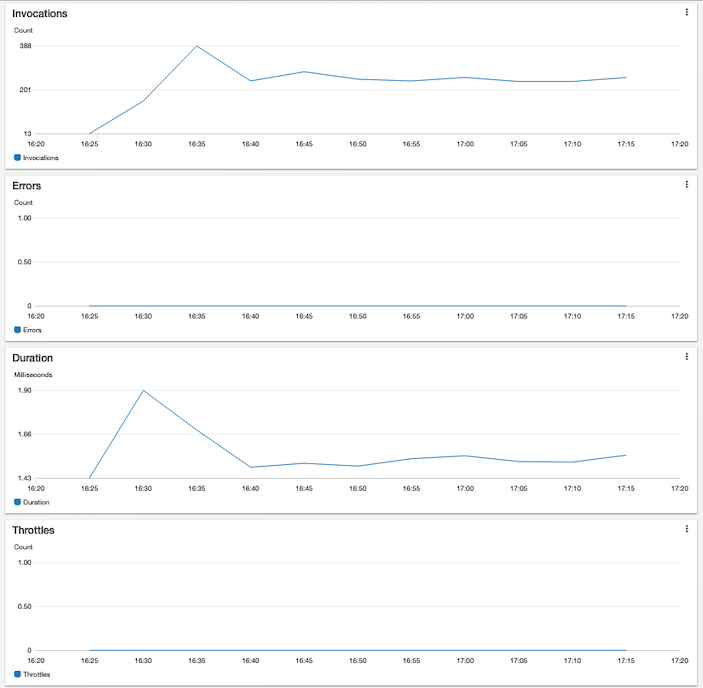

# CloudWatch Dashboards for Lambda Functions

This project demonstrates how to setup a CloudWatch Dashboard for Lambda Functions.
CloudWatch dashboards are used to create customized views of the metrics and alarms for your AWS resources.

This CDK sample uses an AWS Lambda Function, as an example, for the source of CloudWatch metrics. This 
approach can used with AWS Services that create [CloudWatch metrics](https://docs.aws.amazon.com/AmazonCloudWatch/latest/monitoring/working_with_metrics.html) or even [Custom CloudWatch metrics](https://docs.aws.amazon.com/AmazonCloudWatch/latest/monitoring/publishingMetrics.html) that you publish yourself.

The following resources are defined in the CDK Stack:
- [AWS Lambda Function](https://aws.amazon.com/lambda/)
- [Amazon CloudWatch](https://aws.amazon.com/cloudwatch/)

After deploying solution, you will have created a CloudWatch Dashboard, like the one shown below:



---
### Requirements:

- git
- npm (node.js)
- AWS access key & secret for AWS user with permissions to create resources listed above

---

## Setup

Clone this repo:
```bash
git clone https://github.com/aws-samples/aws-cdk-examples.git
```

Change directory:
```bash
cd aws-cdk-examples/typescript/lambda-cloudwatch-dashboard
```

To build this app, you need to be in this example's root folder. Then run the following:
```bash
npm install -g aws-cdk
npm install
npm run build
```

This will install the necessary CDK, then this example's dependencies, and then build your TypeScript files and your CloudFormation template.


## Deployment

This stack uses assets, so the toolkit stack must be deployed to the environment. This can be done by running the following command:
```bash
cdk bootstrap --profile=<you_aws_profile> aws://account-id/aws-region
```


At this point you can now synthesize the CloudFormation template for this code:
```bash
cdk synth
```

And proceed to deployment of the stack:
```bash
cdk deploy
```

## Test

### Invoke Lambda Function
In order to generate some metrics, you can invoke the sample Lambda Function:

Replace `<NAME_OF_FUNCTION>` with the value of this CDK Stack Output: `LambdaCloudwatchDashboardStack.LambdaName`
```
aws lambda --profile=<You_AWS_Profile> invoke --function-name <NAME_OF_FUNCTION> text_output.txt
```

### View CloudWatch Dashboard

1) Sign into to the AWS Console
2) Navigate to the URL in this CDK Stack Output: `LambdaCloudwatchDashboardStack.DashboardOutput`
3) Please note, the metrics are aggregated for a period of 5 minutes before being displayed on the Dashboard.  The value of the period can be configured, please see the [CDK documentation](https://docs.aws.amazon.com/cdk/api/latest/docs/@aws-cdk_aws-cloudwatch.MetricProps.html) for further details.


## Clean Up
To clean up, issue this command:
```
cdk destroy
```

## Useful commands

 * `cdk ls`          list all stacks in the app
 * `cdk synth`       emits the synthesized CloudFormation template
 * `cdk deploy`      deploy this stack to your default AWS account/region
 * `cdk diff`        compare deployed stack with current state
 * `cdk docs`        open CDK documentation

Enjoy!